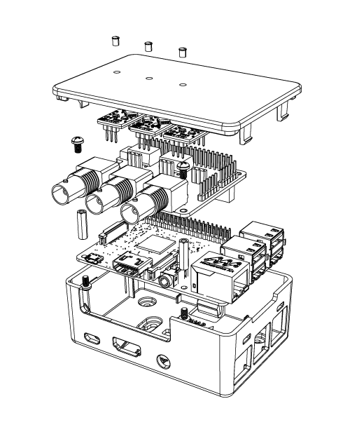

# Introduction {docsify-ignore-all}

The Whitebox B3 Project Enclosure is a box for your Raspberry Pi, the [Whitebox Tentacle T3](https://www.whiteboxes.ch/shop/tentacle-t3-for-raspberry-pi/)
and [Atlas Scientific EZO devices](https://www.whiteboxes.ch/product-category/circuits/) with a snug fit. It has several mounting options, is rattle-free and easy to open and close.

_Atlas Scientific EZO-class devices and Whitebox Tentacle T3 are not included_

# Compatibility
## Model B3.PI3 {docsify-ignore}
* Raspberry Pi 2 Model B
* Raspberry Pi 3 Model B
* Raspberry Pi 3 Model B+

## Model B3.PI4 {docsify-ignore}
* Raspberry Pi 4 Model B

# Prepare the Enclosure

## Mounting the light pipes {docsify-ignore}

Plug the 3 plastic light pipes into the holes in the enclosure lid.

## Opening the enclosure {docsify-ignore}

Press firmly on the lid-release to open the lid.

## Closing the enclosure {docsify-ignore}

When installing the lid you can put either end in first.

# Assembly

## 1. Mount the 2 standoffs to the Raspberry Pi {docsify-ignore}

## 2. Mount Raspberry Pi into the enclosure {docsify-ignore}
Insert the Pi - place the Pi's PCB edge under under the two tabs

Press the Pi down so it snaps under the spring latch near the 40 pin connector

## 3. Stack the Whitebox Tentacle T3 onto the Pi {docsify-ignore}

You can use the holes as a visual guide.

## 4. Secure the T3 with screws {docsify-ignore}

## 5. Plug in the EZO circuits and probes {docsify-ignore}

# Disassembly

?> Remove the assembled Raspberry Pi + Tentacle T3 stack from the enclosure. Don't remove the T3 while in the enclosure as this could easily bend the Raspberry Pi pins

## 1. Open the spring latch to remove and remove the Pi including the T3 {docsify-ignore}

# Mounting options

## Desktop {docsify-ignore}

## Removable Wall Mount {docsify-ignore}

## Permanent Mount {docsify-ignore}

# Buy
* From our [<i class="fas fa-shopping-cart"></i> store](https://www.whiteboxes.ch/shop/b3-project-enclosure/) – we ship worldwide

*Made Canada*   *, modified in Switzerland* 
