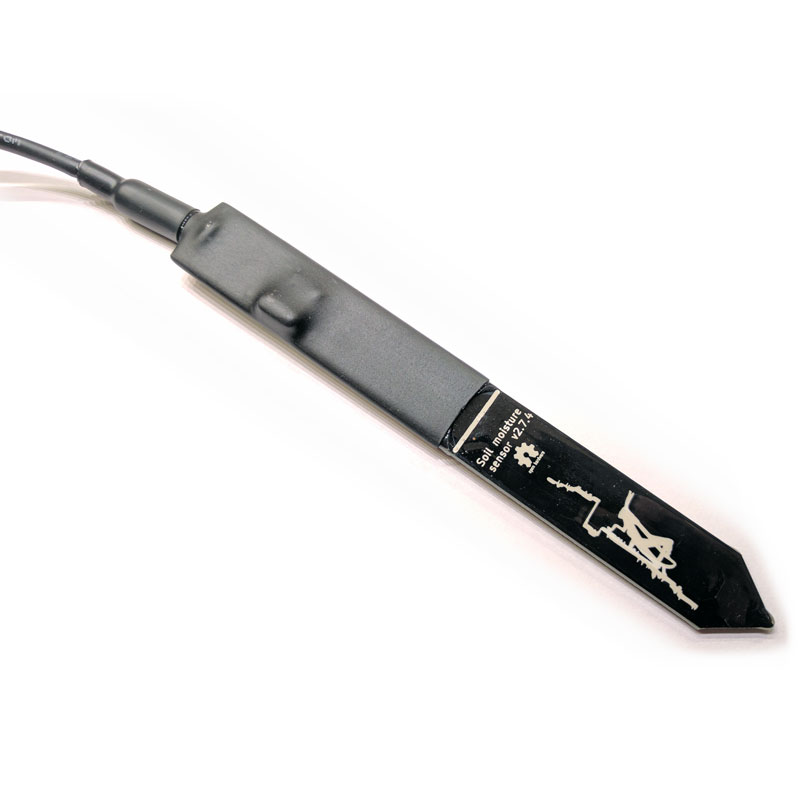

# I2C Soil Moisture Sensor

?> This documentation page is automatically generated directly from the README in the orinial GitHub repository by miceuz. [Visit original](https://github.com/Miceuz/i2c-moisture-sensor)

[filename](https://raw.githubusercontent.com/Miceuz/i2c-moisture-sensor/master/README.md ':include')
