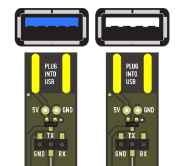
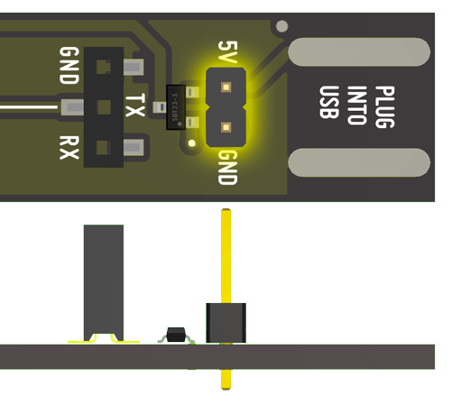

# Introduction {docsify-ignore-all}

_Atlas Scientific EZO-class devices are not included_

## What’s the I2C Toggler?
The I2C Toggler is a tool to switch the protocol type of an EZO Circuit from `UART` to `I2C` and back by the press of a button. No code, no wiring.

# How to use the I2C Toggler?

1. Select EZO circuit type with the switch - either:
 * RTD or
 * pH / EC / ORP / DO
1. Insert your EZO™ circuit
1. Plug I2C Toggler into USB port/cable
1. Press and hold button for ~1 second
1. Release after color change:
 * Blue =  `I2C`
 * Green = `UART`

 

## Compatible EZO Circuits
* `EZO pH` Circuit
* `EZO EC` Circuit
* `EZO ORP` Circuit
* `EZO DO` Circuit
* `EZO RTD` Circuit

## Incompatible circuits
* EZO Flow Meter Totalizer
* Legacy circuits pre-EZO V3.0 - V6.0

## Powering the I2C toggler

### Just plug into USB!
Works with USB 1.0 / 2.0 / 3.0 Type A sockets.

Directly plug the I2C Toggler PCB into an USB port of a laptop in the field, USB charger, USB cable or similar. Orientation does not matter, the I2C Toggler can be used in all rotations.

### 5V pin header

Alternatively to the USB, you can solder on pin headers (2.54mm pitch) and power it by 3.3V - 5V. Pin headers are not included. Don't use USB and the pin headers at the same time.

<small>_Made by_</small>

<small>_Works with_</small>

# License
Hardware design files and documentation are licensed under Attribution-ShareAlike 4.0 International (CC BY-SA 4.0)
https://creativecommons.org/licenses/by-sa/4.0/

[Hardware source files on Github](https://github.com/whitebox-labs/whitebox-i2c-toggler-oshw)

# Buy
* From our [<i class="fas fa-shopping-cart"></i> store](https://www.whiteboxes.ch/shop/i2c-toggler) – we ship worldwide
* or from a [distributor](https://www.whiteboxes.ch/distributors)

*Made in Switzerland* 
