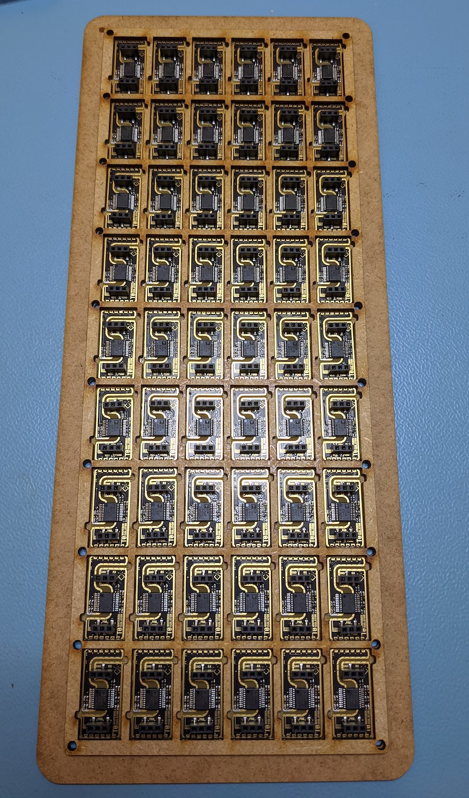

# <i class="fas fa-industry"></i> Manufacturing <!-- {docsify-ignore} -->

## Pick & Place
* Pick the T0 at its physical center, right on the central chip (ADM3260).

### Re-usable Component Tray
We provide a set of wooden, re-usable trays to be used in pick & place machines to OEM customers.

The tray pictured below is for 54 T0s, measures 135mm x 224mm. We can adapt the size of the tray to your machine and production workflow.

## Soldering
* Coming soon

## High Impedance Shorts

!> High impedance shorts make accurate sensor readings impossible. Signs of a high impedance short are locked values to a certain value, slowly drifting values even in calibration solution and others.

High impedance shorts can be introduced by overflowed flux residue. Flux residue should be removed or prevented by adapting soldering process. Hand-soldering or manual rework is prone to overflowing flux. Remove the flux if you can measure a high impedance short (see testing technique described below). Remove the flux with a flux remover chemical recommended by your solder/flux supplier.

The pins vulnerable to high impedance shorts are
* Pin 8 (GND_ISO)
* Pin 9 (PRB_GND)
* Pin 10 (PRB)
* Pin 11 (PRB_GND)

## Functional Testing
After manufacturing you can confirm the proper function of the T0 in your product by testing:

### Power Test

Devices under test passes the test, if
* with ENABLE is pulled low, output from V_ISO to GND_ISO is 0V
* with ENABLE is pulled high, output from V_ISO to GND_ISO is 3.8 - 3.95V

### High impedance shorts Test
Devices under test passes the test, if
* No high impedance short between GND_ISO and PRB_GND
* No high impedance shorts between PRB and PRB_GND

If either test fails, clean the T0 solder points and any other exposed pins/pads of the respective signals from flux residue, grease, etc and repeat the test.

### Testing procedure
A quick way to find impedance shorts is by applying a voltage across the the two signals with an inline voltmeter. You need a 9V battery (or other 9V power source) and a voltmeter (e.g. a multimeter in the mV setting).

* Disconnect all cables and connections from the device under test (DUT). Disconnect battery, if your device is battery powered.
* isolate the DUT on a non-conductive surface, e.g. a silicone mat. Your antistatic mat is conductive and must be isolated from the DUT.
* Set your voltmeter to the mV setting
* Connect the positive battery pole (+) to the first signal (e.g. PRB)
* Connect the positive test lead (red) of your voltmeter to the second signal (e.g. PRB_GND)
* Connect the negative (black) test lead of your voltmeter to the negative battery pole (-).
* Do not touch any parts of the test setup while taking the reading

If your voltmeter can detect a voltage > 2mV, there is a high impedance short that can prevent good sensor readings. If the reading is <= 2mV, the test is passed.
