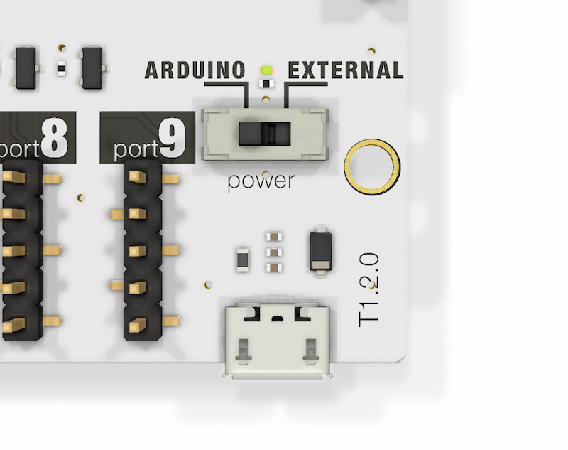

# <i class="fas fa-bolt"></i> Power

## Power Consumption

**Add the consumption of each of your EZO Circuits**

[filename](../common/ezo-power-consumption.md ':include')

## Arduino vs external power
When stacking multiple shields or when using power hungry sensors, it can be a challenge to power everything through the Arduino. In this case, you can power the T1 and all EZO devices by an external 5V power source. On-board level shifters for I2C and the T1 GPIO shift the signals safely to the voltage present on IOREF. This is usually is 3.3V or 5V on Arduinos.

### Power through Arduino
Power switch is set to `ARDUINO`
All attached EZO devices and the isolators are powered by the Arduino IOREF pin.

### External power
- Power switch is set to `EXTERNAL`
- Plug in a power supply with 5V to the Whitebox T1's Micro USB connector.
All attached EZO devices and the isolators are powered by the external 5V power source.

## Schematic
* <i class="far fa-file-pdf"></i> Schematic
* <i class="fab fa-github"></i> Hardware source files on GitHub
