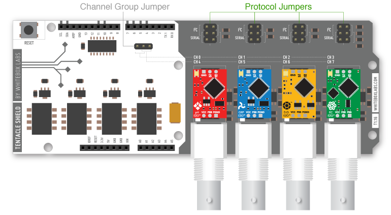
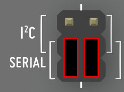
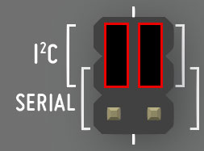
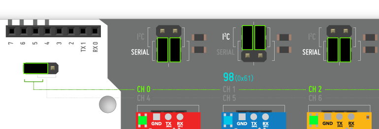
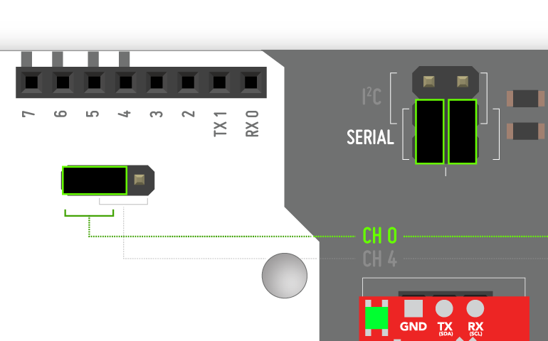
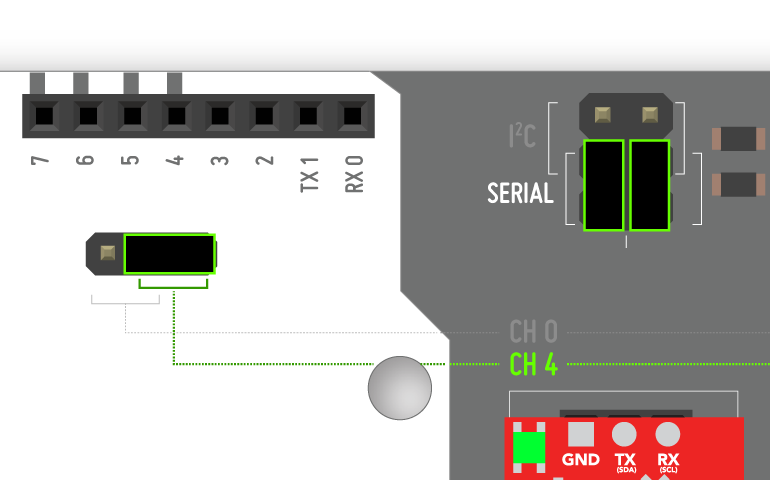
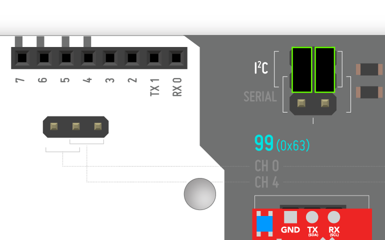

# Jumper Settings

## Protocol Jumpers

Each of the 4 channels on the Tentacle Shield needs their `Protocol Jumpers` set. Each channel needs two jumpers, one for each communication line (RX/TX or SDL/SCL).

!> ** Only changing the jumpers will not change the mode of the circuit.** There are multiple ways to toggle between the [EZO Protocols](protocols.md). **After** the protocol has been changed, change the `Protocol Jumpers` to adapt to the EZO Circuits new protocol.

### UART mode
?> With the `UART` protocol EZO Circuits are addressed using the channel numbers printed on the PCB. 0-3 or 4-7  depending on the setting of the [Channel Group Jumper](#channel-group-jumper)

### I2C mode
?> With the `I2C` protocol the EZO Circuits are identified using their `I2C` address, set in the EZO Circuit itself.

### Mixed
Both `I2C` and `UART` protocol can be used at the same time.

## Channel Group Jumper

The `Channel Group Jumper` selects a group of UART channels for a shield. This is useful if you stack two Tentacle Shields. One of the shields will have channels 0-3 and the other 4-7. If you don't use UART at all, you can remove this jumper to disable the UART multiplexer and free up pins (see [Pinout](pinout.md)).

### UART channels 0-3
?> In this configuration you can use circuits in UART mode and I2C mode. The UART circuits have channels 0, 1, 2, 3 (printed on the PCB).

### UART channels 4-7
?> In this configuration you can use circuits in UART mode and I2C mode. The UART circuits have channels 4, 5, 6, 7 (printed on the PCB).

### I2C only
?> In this configuration, all your circuits must be in I2C mode. The channel numbers printed on the PCB have no meaning - the I2C address is used to connect to the circuits.

