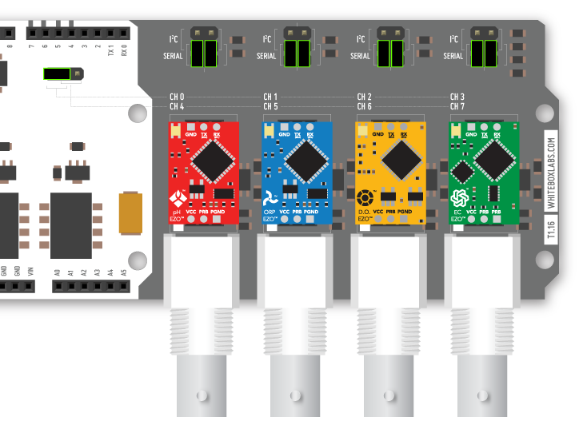
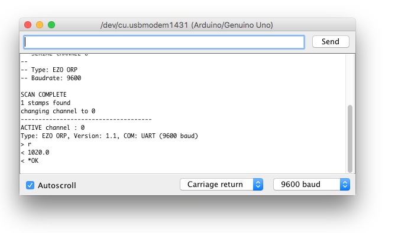

# Quickstart Tutorial

## Prerequisites
For this quickstart tutorial you need:
* One or more EZO Circuits by Atlas Scientific
* An Arduino (also see [Compatibility](compatibility.md))
* A [Tentacle Shield for Arduino](https://www.whiteboxes.ch/shop/tentacle/)
* The [Tentacle Setup Sketch](https://raw.githubusercontent.com/whitebox-labs/tentacle-examples/master/arduino/tentacle-setup/tentacle_setup/tentacle_setup.ino ':target=_blank')

?> Set the jumpers as shown in the image below. _This is the factory setting_



## Setup Procedure

?> Your Arduino should be **off** and the Tentacle Shield not yet plugged into the Arduino.


1. Plug your Atlas Scientific circuits into the Tentacle Shield
 * There’s no predefined order for the circuits, you can put them in arbitrary order.
 * Double-check the correct orientation of the EZO circuits
1. Mount the Tentacle shield to your Arduino
1. Power up the Arduino
1. Load the [Tentacle Setup Sketch](https://raw.githubusercontent.com/whitebox-labs/tentacle-examples/master/arduino/tentacle-setup/tentacle_setup/tentacle_setup.ino ':target=_blank') to your Arduino
1. Open the Arduino IDE serial monitor `@9600 baud` 
1. type `scan` and press ENTER.

?> This will take up to a minute.

```
------------------
-- SERIAL CHANNEL 0
--
-- Type: EZO pH
-- Baudrate: 9600

SCAN COMPLETE
1 stamps found
```

You will see all your circuits appearing. In this example, only one EZO ORP circuit is mounted and it has the channel number `0`


## Interact with the EZO Circuits
Connect to a circuit by typing it’s channel number: `0<ENTER>`

```
changing channel to 0
-------------------------------------
ACTIVE channel : 0
Type: EZO ORP, Version: 1.1, COM: UART (9600 baud)
```

Whatever you type now, is directly sent to the circuit on serial channel 0. For example, type `r` to get the newest reading.



Congratulations, you’re all set to configure and use your Atlas Scientific circuits! Grab the datasheet of your EZO circuit and start exploring all the available commands.

## EZO Circuit Datasheets
[filename](../common/ezo-datasheets.md ':include')
