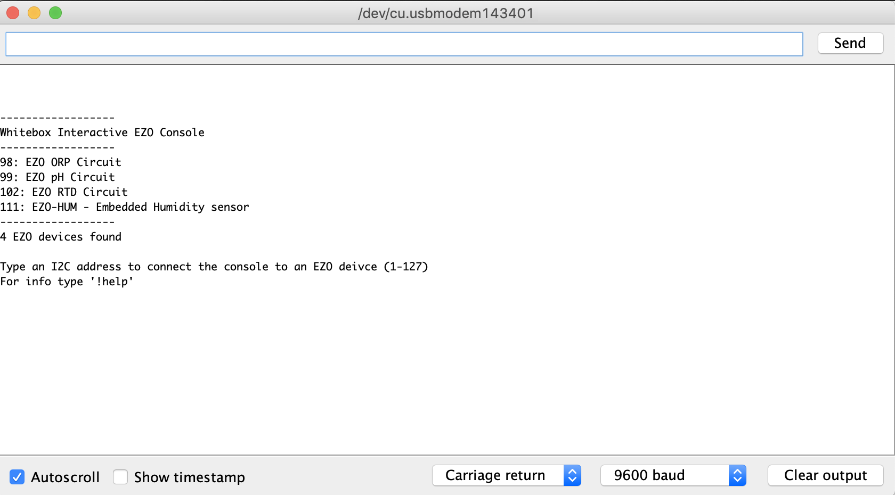

# Quickstart Tutorial

## Prerequisites
For this quickstart tutorial you need:
* One or more EZO Devices by Atlas Scientific, protocol set to `I2C`
* An Arduino (also see [Compatibility](compatibility.md))
* One or more [Whitebox T2 Mini for Arduino](https://www.whiteboxes.ch/shop/t2-mini-mk2/)
* The [Whitebox Interactive EZO Console](https://github.com/whitebox-labs/whitebox-ezo-console/archive/main.zip ':target=_blank')

!> **I2C only** The Whitebox T2 Mini works with EZO devices in `I2C` mode only. Before using your EZO devices with the Whitebox T2 Mini, switch them to `I2C`. [How to switch EZO Circuits to I2C](protocols.md)

## Setup Procedure

?> Your Arduino should be **off** and the Whitebox T2 Mini not yet plugged into the Arduino.


1. Switch your EZO devices to `I2C`. [How to switch EZO Circuits to I2C](protocols.md)
1. Plug your Atlas Scientific devices into the Whitebox T2 Mini. See [Pinout](pinout.md) to learn what devices are suited for which ports.
 * Double-check the correct orientation of the EZO devices
1. Mount the Whitebox T2 Mini to your Arduino
1. DO NOT yet connect any probes
1. Power up the Arduino
1. Upload the [Whitebox Interactive EZO Console](https://github.com/whitebox-labs/whitebox-ezo-console/archive/main.zip ':target=_blank') to your Arduino board
1. Open the Arduino IDE serial monitor `@9600 baud` 
1. You can now use the EZO Console.

```
------------------
Whitebox Interactive EZO Console
------------------
98: EZO ORP Circuit
99: EZO pH Circuit
102: EZO RTD Circuit
111: EZO-HUM - Embedded Humidity sensor
------------------
4 EZO devices found

```

When first started, the EZO Console will scan for all attached EZO devices and list them with their respective I2C address.


## Interact with the EZO devices
Connect to a device by typing it’s channel number: `99<ENTER>`

```
0> 99
------------------
ACTIVE DEVICE:
EZO pH Circuit
Address: 99 | Firmware: 1.1
------------------
```

You are now connected to the EZO device, in this example an EZO pH circuit with I2C address `99`. You can now type commands directly to the selected EZO device - for example type `r` to request a reading:
```
99> r
99> 0.000

```
?> The reading shows a pH of 0.000 because no probe has been connected yet.

Congratulations, you’re all set to configure and use your Atlas Scientific EZO deivces! Grab the datasheet of your EZO device and start exploring all the available commands.

You can now start adding the actual probes, calibrate them, etc.

## EZO Circuit Datasheets
[filename](../common/ezo-datasheets.md ':include')

## Whitebox Interactive EZO Console commands
The EZO console comes with some useful helper commands.

### Poll readings
When connected to an EZO device, you can poll the read command continuously.
`!poll`

Change to the device of your choice - in this example a EZO-HUM Embedded Humidity sensor at I2C address `111`. Then, issue the `!poll`command.

```
99> 111
------------------
ACTIVE DEVICE:
EZO-HUM - Embedded Humidity sensor
Address: 111 | Firmware: 1.0
------------------
111> !poll
111> 33.65
111> 33.65
111> 33.65
111> 33.64
111> 34.17
111> 34.17
111> 35.44
111>
```

To cancel the polling, issue another command or just press <ENTER>.

### Scan for EZO Devices
You issue a new scan by typing
`!scan`

```
111> !scan
------------------
98: EZO ORP Circuit
99: EZO pH Circuit
102: EZO RTD Circuit
111: EZO-HUM - Embedded Humidity sensor
------------------
4 EZO devices found
```
All connected EZO devices are listed alongside their I2C adddres.

### Display Help
To show a description of all commands, type
`!help`

```
111> !help
------------------
To connect to an attached EZO device, type its address (1-127) followed by ENTER
To send an I2C command to the EZO device, enter it directly to the console. e.g. 'r<ENTER>'
You can find all available I2C commands in the datasheet of your EZO device.
Available console commands:
!scan     lists all attached EZO devices
!poll     polls the 'read' command of the current EZO device every second
          to cancel polling, send any command or <ENTER>
!help     this information
------------------
```
