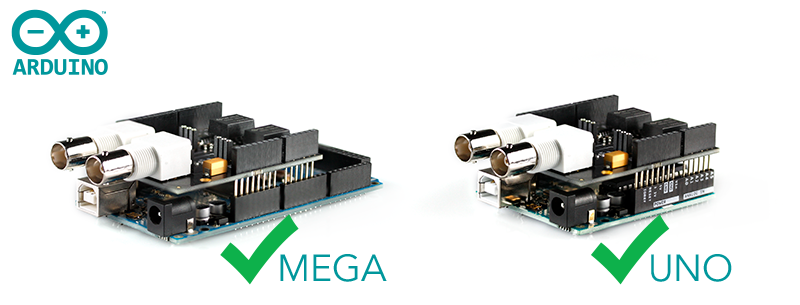

# Compatibility

## Arduino Compatibility

### Compatible Boards
* Arduino Uno (R3)
* Arduino Mega 2560 (R3)
* Arduino Leanardo
* Arduino Yun
* Arduino 101
* Arduino Zero
* Arduino Due
* and most (all?) Arduino-compatible boards with R3 Pinout

## EZO Circuit Compatibility

### Compatible Circuits
* EZO pH Circuit
* EZO EC Circuit
* EZO ORP Circuit
* EZO DO Circuit
* EZO RTD Circuit

### Incompatible circuits
* EZO Flow Meter Totalizer
* Legacy circuits V3.0 - V6.0
