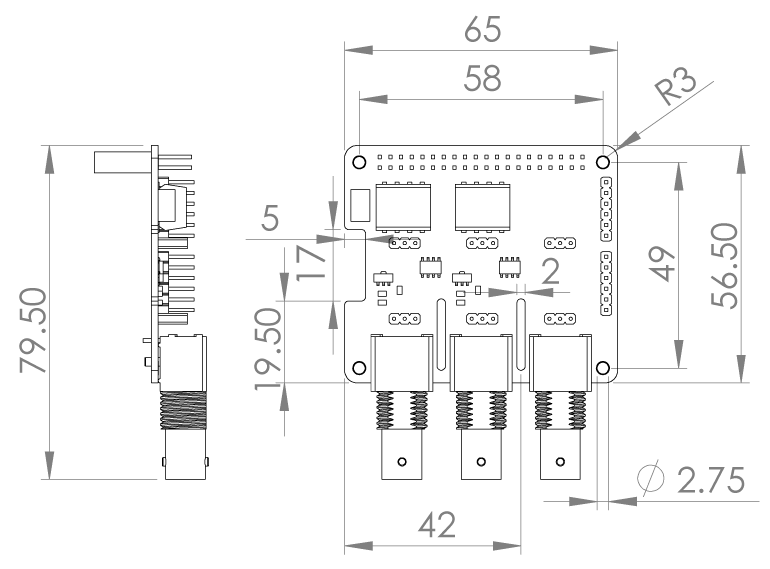

# <i class="fas fa-ruler"></i> Mechanical Specifications

* Dimensions: 65 x 56.5mm (65mm x 79.5 incl. BNC)
* Weight: 48g

## Drawings

* <i class="far fa-file-pdf"></i> [Mechanical Drawing (PDF)](https://github.com/whitebox-labs/tentacle-raspi-oshw/raw/master/hardware/mechanical/tentacle_t3_mechanical.pdf)
* <i class="far fa-file-pdf"></i> [BNC Connector Mechanical Drawing (PDF)](https://github.com/whitebox-labs/tentacle-raspi-oshw/raw/master/hardware/mechanical/bnc_mechanical.pdf)

## 3D Models

* <i class="fas fa-cube"></i> [3D-Model](https://github.com/whitebox-labs/tentacle-raspi-oshw/raw/master/hardware/mechanical/tentacle_t3.stl) (STL) [view online](https://github.com/whitebox-labs/tentacle-raspi-oshw/blob/master/hardware/mechanical/tentacle_t3.stl)
* <i class="fas fa-cube"></i> [3D-Model](https://github.com/whitebox-labs/tentacle-raspi-oshw/raw/master/hardware/mechanical/tentacle_T3.STEP) (STEP)
