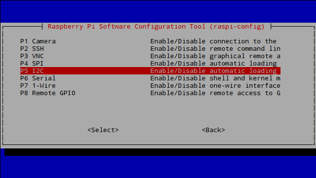
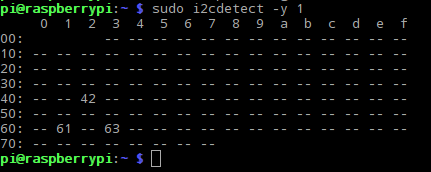

# <i class="fas fa-angle-double-right"></i> Quickstart Tutorial

## Prerequisites
For this quickstart tutorial you need:
* One or more EZO Circuits by Atlas Scientific, protocol set to `I2C`
* A Raspberry Pi (2, 3, 4, Zero - see [Compatibility](compatibility.md) for a full list)
* A [Tentacle T3 for Raspberry Pi](https://www.whiteboxes.ch/shop/tentacle-t3-for-raspberry-pi/)

!> **I2C only** The Tentacle Mini works with EZO circuits in `I2C` mode only. Before using your EZO Circuits with the Tentacle Mini, switch them to `I2C`. [How to switch EZO Circuits to I2C](protocols.md)

## Preparing the Raspberry Pi

?> Don't mount the Tentacle T3 to the Raspberry Pi yet

1. Download a recent version of Raspbian _(this Tutorial was made with Jessie, Release 2017-03-02, but any later version should work)_:
https://www.raspberrypi.org/downloads/raspbian/
1. Burn the img-file to an SD card, e.g. using [Etcher](https://etcher.io/) (for Windows, OSX, Linux)
1. Boot your Pi (the Tentacle T3 still **not connected**)
1. Use the terminal to start the `raspi-config` tool:
```
sudo raspi-config
```
1. In the menu, find the option to activate `I2C`.
 
 * At the time of writing this is under `5 Interfacing Options` > `P5 I2C`
1. Enable `I2C`
1. Reboot your Pi
1. Upgrade the system packages:
```
sudo apt-get update
sudo apt-get upgrade
```
1. Install the I2C tools:
```
sudo apt-get install python-smbus
sudo apt-get install i2c-tools
```
1. Reboot your Pi

## Prepare the hardware
?> Your Raspberry Pi is powered **off**

1. All your EZO devices must be in I2C mode. [How to switch EZO Circuits to I2C](protocols.md)
1. Mount the supplied pcb standoffs to the Tentacle T3 for stability
1. Plug your EZO circuits into the Tentacle T3
1. **<i class="fas fa-exclamation-triangle"></i> Double-check the correct circuit orientation**
1. Power up the Raspberry Pi

## Test I2C

In the terminal, type
```
sudo i2cdetect -y 1
```
you will see all your I2C devices in the table.



_When the screenshot was taken, an EZO pH Circuit (0x63), an EZO DO Circuit (0x61) and a HDC1008 humidity sensor (0x42) have been connected to the Raspbyerry Pi._

**Default I2C Addresses:**
* `EZO DO`: **97** _(0x61)_
* `EZO ORP`: **98** _(0x62)_
* `EZO pH`: **99** _(0x63)_
* `EZO EC`: **100** _(0x64)_
* `EZO RTD`: **102** _(0x66)_
* `EZO PMP`: **103** _(0x67)_

## Ready {docsify-ignore}
to run some [code](code.md)!
