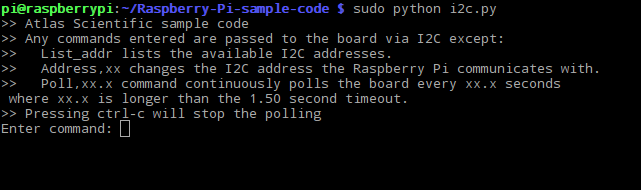

# <i class="fas fa-code"></i> Code

Download the Whitebox EZO code for Raspberry Pi. It gives you an console to interact with all attached EZO devices:

https://github.com/whitebox-labs/whitebox-raspberry-ezo

or use git: `git clone https://github.com/whitebox-labs/whitebox-raspberry-ezo.git`

Run the I2C code:

```
sudo python i2c.py
```

You’ll be presented with an interactive console:



To list attached EZO devices, type:

```
LIST
```

To directly connect to a specific EZO device, type the address, followed by ":" and the a command for the EZO device. To read from a device, type `XX,r` (XX is the address of the circuit):

```
99:r
```

You’re now connected to the circuit at address `99`. Type any command to this device - e.g. try `status`. To get information about the circuit, type `i`.

Grab the datasheet of your circuit and try out some other commands:

[filename](../common/ezo-datasheets.md ':include')


To continuously poll the reading of a circuit, use the command `Poll`. Its parameter is the polling frequency - here 1.5 seconds:

```
POLL
```

More commands are displayed when you start the script.

## 3rd-party Code
### Python 3
Thanks to Jef Roosens for translating the example code to Python 3!

https://github.com/OriginalJef/AtlasScientificI2C
